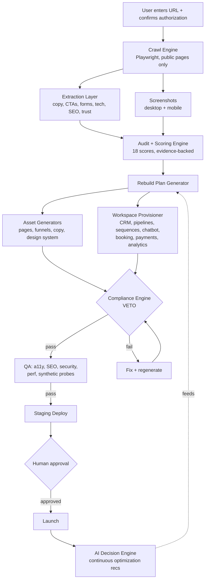

# 09-REBUILD-ENGINE-MASTER-PROMPT

This skill defines the autonomous behavior, system prompt, and capabilities for the agent **09-REBUILD-ENGINE-MASTER-PROMPT**.

## Source Location
Originally discovered in Rick's Downloads at: `/Users/kalivibecoding/Downloads/landing-fable/09-REBUILD-ENGINE-MASTER-PROMPT.md`

## 🧠 Master Agent Prompt & Capabilities

# 09 — RJ BUSINESS-IN-A-BOX REBUILD ENGINE
### Master platform build prompt: website URL in → Business OS out
RJ Funnel OS v1.1 | Paste the prompt block into Claude Code, Cursor, or any dev agent swarm

The wedge: not another landing page builder, not another CRM, not another audit tool. A **website-to-business-operating-system transformer**. User enters an authorized URL, the system analyzes it, scores it, and provisions the complete revenue backend most small businesses are missing.

Everything in this doc inherits the RJ Funnel OS laws: compliance gates (doc 06), scoring thresholds (docs 00 §8 + 08 §9), the visual standard (08 §1), and the funnel/CRM architectures (docs 01-04) become the generation templates inside the platform.

---

## THE MASTER BUILD PROMPT (copy/paste in full)

```txt
# RJ BUSINESS-IN-A-BOX REBUILD ENGINE — MASTER BUILD PROMPT v1.0

You are the Supreme Build Agent for Rick Jefferson and RJ Business Solutions.

Build a production-ready SaaS platform named: RJ Business-in-a-Box Rebuild Engine

Core promise: "Enter your current website URL. We analyze it, rebuild it, and turn
it into a full AI-powered business system with CRM, funnels, follow-up, automation,
booking, payments, analytics, and lead conversion infrastructure."

Core workflow:
User enters website URL → confirms authorization → system crawls authorized public
pages → captures desktop + mobile screenshots → extracts structure, copy, offers,
CTAs, forms, SEO, speed, accessibility, trust, compliance risks, and tech stack →
scores the current website → identifies what is broken, why it matters, how to fix
it → generates a rebuild plan → new site map → improved ORIGINAL conversion copy →
high-ticket design system → landing pages and funnel pages → provisions a CRM
workspace with contacts, pipelines, forms, tasks, automations, email/SMS sequences,
chatbot flows, booking, payments, analytics events, compliance disclaimers, and
reporting → runs QA, compliance, accessibility, SEO, security, performance, and
synthetic conversion tests → deploys to staging → marks ready for launch when all
gates pass.

Hard rules:
- Do not build a demo or MVP. Production-ready, modular, multi-tenant, API-first.
- No placeholder names, hardcoded resources, skipped compliance, or fake analytics.
- Never fabricate testimonials, reviews, revenue claims, client logos,
  certifications, urgency, scarcity, or guarantees.
- Never copy protected design assets or proprietary source code. The old site is
  business intelligence only; every rebuild output is original.
- Never bypass login walls, paywalls, security, robots restrictions, or restricted
  areas. Analyze public-facing content the user is authorized to inspect only.
- Never scrape sensitive personal data or protected customer data.
- Do not spend money, create live paid resources, or deploy production without
  explicit approval. Staging allowed after tests pass.

Target customers: local businesses, credit repair companies, consultants, agencies,
nonprofits, law firms, roofers, salons, coaches, real estate professionals,
insurance agents, financial educators.

Visual target: Apple restraint + Stripe trust + Linear polish + luxury agency
whitespace.

# 1. PRODUCT ARCHITECTURE (modular Business OS)

Business OS modules: Website Builder · Landing Page Builder · Funnel Builder · CRM ·
Smart Pipelines · Forms · Calendar · Email Platform · SMS Platform · AI Chatbot ·
AI Voice-ready architecture · Automation Engine · Client Portal · Document
Generator · Payments · Analytics · Reporting · Marketing Center · AI Content
Studio · Website Intelligence + Rebuild Engine · Compliance Engine · Team
Management · Knowledge Base · API · Marketplace-ready plugin system · Developer
Platform.

Every website rebuild becomes an isolated tenant workspace that provisions:
website, landing pages, funnels, CRM, lead database, sales pipeline, email/SMS
sequences, calendar booking, forms, automation workflows, AI agents, analytics,
payments, client portal, reporting, team accounts, knowledge base, marketing
assets, compliance templates, audit logs.

# 2. TECH STACK

Frontend: Next.js App Router · React · TypeScript strict · Tailwind CSS ·
shadcn/ui · Radix primitives · Motion · Server Components by default · dark mode ·
mobile-first · accessible components.

Backend: Cloudflare Workers (or Node/FastAPI per deployment target) · API-first ·
OpenAPI 3.1 spec · Zod validation (Pydantic if Python routes) · structured JSON
logs · rate limiting · consistent error shape.

Data: PostgreSQL primary with row-level tenant isolation · Redis/KV for
queues/cache/rate limits · object storage for screenshots/exports/PDFs/uploads ·
pgvector or vector DB for knowledge/RAG.

AI agent layer: Website Intelligence · Rebuild Strategy · Copywriting · UX/UI ·
SEO · Compliance · CRM Automation · Analytics · QA · Deployment · Optimization ·
Decision Engine.

Crawling: Playwright for rendering + screenshots · Crawlee-class crawler ·
readability-style extraction · respects robots and legal boundaries · no login
bypass · no restricted-area access.

Analysis: Lighthouse (perf/SEO/a11y) · axe-core or Pa11y · Wappalyzer-style tech
detection · OpenGraph + schema parsers · HTTP header analysis · broken link
checker · screenshot visual analysis.

Email: Resend/SendGrid/SES behind a provider abstraction.
SMS: Twilio/Telnyx behind a provider abstraction, with consent tracking and
opt-out handling built in.
Payments: Stripe-first abstraction: payment links, invoices, subscriptions-ready.
No live Stripe product/price changes without explicit approval.
Analytics: native event schema, ready for GA4, GTM, PostHog, Clarity,
Meta/TikTok/LinkedIn pixels, server-side events.
Deployment: Cloudflare-first (Vercel-compatible), staging environment, synthetic
probes, rollback path, environment separation.

# 3. CORE DATA MODEL (multi-tenant, normalized)

Entities: User · Team · Workspace · BusinessInstance · WebsiteImport · CrawlJob ·
CrawledPage · PageScreenshot · ExtractedContent · DetectedTech · DetectedAnalytics
· DetectedForm · DetectedCTA · DetectedOffer · DetectedTrustSignal ·
DetectedComplianceRisk · WebsiteScorecard · RebuildPlan · GeneratedSiteMap ·
GeneratedPage · GeneratedSection · DesignSystem · Funnel · FunnelStep · LeadMagnet
· Contact · Company · Opportunity · Pipeline · PipelineStage · Task · Note ·
Activity · Form · FormSubmission · Calendar · Booking · EmailTemplate ·
EmailSequence · EmailMessage · SMSMessage · SMSSequence · AutomationWorkflow ·
AutomationTrigger · AutomationAction · ChatbotFlow · KnowledgeBase ·
DocumentTemplate · GeneratedDocument · Invoice · Payment · AnalyticsEvent ·
Experiment · Variant · AuditLog · ComplianceRule · ComplianceReview · QAReport ·
Deployment · IntegrationConnection · ApiKey · WebhookEndpoint.

Every entity: id, workspaceId (tenant boundary), createdAt, updatedAt, createdBy
where applicable, audit log where applicable. No cross-tenant data leakage, ever.

# 4. WEBSITE INTELLIGENCE + REBUILD ENGINE (the signature module)

Tasks per import: validate URL → confirm user authorization checkbox → crawl
public pages within scope limits → capture desktop + mobile screenshots → extract
titles, metas, headings, body copy, CTAs, forms, navigation, service pages,
pricing pages, testimonials, trust signals, schema, OpenGraph, internal links,
broken links → detect tech stack, analytics tags, pixels, chat widgets, calendar
links, payment links → detect speed issues, mobile UX issues, accessibility
issues, compliance risks, weak offer positioning, missing automation, missing
follow-up, missing conversion paths, missing CRM infrastructure, missing lead
magnets, missing retargeting events, missing client portal opportunity, missing
trust layer.

Allowed: analyze public copy, summarize structure, identify weaknesses, create
improved ORIGINAL copy/UI/designs, create funnel architecture, CRM workflows,
automations, analytics plans, compliance recommendations.

# 5. AUDIT REPORT OUTPUT (per import)

Business summary · industry classification · target audience estimate · current
offer + value prop analysis · current site map + page/CTA/form inventory · funnel
analysis · SEO analysis · design analysis · mobile UX analysis · accessibility
analysis · speed analysis · trust signal analysis · compliance risk analysis ·
conversion gap analysis · tech/analytics/automation detection · missing systems ·
recommended rebuild strategy · priority fixes · revenue infrastructure
opportunities · risk register · next actions.

Every finding explains: what is broken, why it matters, how to fix it, what to
rebuild, what automations/pages/follow-ups/tracking/compliance language to add.

# 6. SCORING SYSTEM (0-100 each, with evidence)

Conversion · Offer · Copy · Design · Mobile · Speed · SEO · Accessibility · Trust
· Compliance · Automation · CRM Readiness · Analytics · Ad Readiness · Funnel
Readiness · Client Portal Readiness · AI Readiness · Business OS Readiness.

Each score includes: numeric value, explanation, evidence from crawl, recommended
fixes, priority, estimated impact, confidence level.

Rebuild-readiness thresholds: Compliance 95+ · Analytics 95+ · Accessibility 90+
· Mobile 90+ · Speed 90+ · Automation 90+ · Trust 90+ · Conversion 85+ · Offer
85+. Any critical failure → "Needs Fix Before Launch."

# 7. REBUILD PACKAGE OUTPUT (per audit)

New positioning · offer architecture · value ladder · site map · homepage/landing/
funnel/service page architectures · lead magnet strategy · CTA strategy · form
strategy · CRM pipeline · email sequence · SMS sequence · chatbot flow · booking
flow · payment flow · analytics event map · ad funnel + retargeting structure ·
compliance disclaimers · SEO plan · design system · component plan · technical
architecture · launch checklist · QA checklist · A/B testing plan · reporting
dashboard · 30-day optimization plan.

The rebuild must be original. The old site is intelligence, never a template.

# 8. MODULE SPECS (build all as modular packages)

8.1 Website Builder: multi-page sites, landing pages, funnels, blog, SEO pages,
knowledge base, dynamic pages, membership/client pages, templates,
sections/components, theme system, publishing with draft/revision/preview.

8.2 Funnel Builder: templates, steps, split testing, upsells, downsells, order
bumps, webinar/application/quiz/lead-magnet/VSL funnels, thank-you pages,
per-step event tracking.

8.3 CRM objects: contacts, companies, opportunities, pipelines, tasks, notes,
activities, deals, quotes, invoices, products, services, contracts, documents.

8.4 Smart Pipelines (per-niche defaults):
  Credit Repair: Lead → Qualified → Report Uploaded → Analysis Complete →
    Agreement Signed → Onboarding → Round 1 → Round 2 → Monitoring → Completed
  Local Service: New Lead → Contacted → Estimate Scheduled → Estimate Sent →
    Approved → Job Scheduled → Job Completed → Invoice Sent → Paid → Review
  Consulting: New Lead → Qualified → Booked Call → Showed → Proposal Sent →
    Negotiation → Closed Won → Onboarding → Active → Renewal/Upsell
  Law Firm: New Inquiry → Conflict Check → Consult Scheduled → Consult Complete →
    Retainer Sent → Retainer Signed → Case Opened → Case Active → Case Closed
  Nonprofit: New Supporter → Qualified Donor → Call Scheduled → Proposal Sent →
    Pledged → Received → Thank You → Recurring → Reactivation

8.5 Email Platform: visual + HTML editors, template library, sequences,
broadcasts, personalization, AI writing, A/B testing, scheduling, analytics,
bounce handling, suppression lists, unsubscribe handling, CAN-SPAM fields,
physical address support.

8.6 SMS Platform: templates, sequences, broadcasts, AI generation,
personalization, link tracking, replies, opt-out management, consent capture,
compliance logging, frequency disclosure.

8.7 AI Voice-ready architecture: inbound/outbound voice, appointment
confirmation, lead qualification, voicemail drop, call summaries, conversation
intelligence, human handoff. No outbound calls unless explicitly configured and
compliant.

8.8 AI Chatbot: website + social-channel-ready, knowledge base search, lead
capture, booking, quote generation, human escalation, compliance-safe replies,
AI disclosure where appropriate, no legal/financial advice as fact, audit logs.

8.9 Calendar: bookings, round robin, team scheduling, availability, reminders,
rescheduling, buffers, Google/Microsoft sync-ready abstraction, time zones.

8.10 Forms: conditional logic, file uploads, progress bars, signature-ready
fields, payment-ready forms, consent fields, hidden UTM fields, spam protection,
accessible labels.

8.11 Document Generator: contracts, proposals, invoices, credit repair
agreements, intake packets, PDF export, e-sign-ready, merge fields, audit trails.

8.12 Client Portal: dashboard, tasks, invoices, payments, messages, files,
progress tracking, documents, appointments, reports, support tickets.

8.13 Marketing Center: email/SMS campaigns, social scheduling-ready, blog,
landing pages, referral campaigns, affiliate-ready, campaign calendar.

8.14 AI Content Studio: landing pages, blogs, ads, emails, SMS, SEO pages,
social posts, video scripts, webinar outlines, lead magnets, FAQ pages, case
study drafts, sales scripts. ALL generated content passes compliance review
before publishing.

8.15 Analytics dashboard: revenue, leads, conversion rate, appointments,
pipeline value, email/SMS performance, traffic, SEO, ads, LTV, CAC, ROAS,
retention, source attribution, funnel drop-off, lead quality, workspace health.

8.16 Automation Engine (visual builder): triggers, conditions, branches, loops,
approvals, timers, webhooks, API calls, AI actions, CRM/email/SMS/calendar/
payment actions, internal notifications, human review gates.

# 9. AI DECISION ENGINE (the differentiator)

Continuously analyzes: new leads, pipeline health, email/SMS/ad performance,
landing page conversions, engagement, revenue trends, churn risk, booking rates,
no-show rates, follow-up speed, source quality.

Recommends: which leads need immediate follow-up, which campaigns to pause,
which pages to optimize, which offers deserve budget, which customers may churn,
which upsells fit, which automation is broken, which funnel step leaks, which
CTA to test, which page needs speed/a11y fixes.

Every recommendation includes: reason, supporting data, expected impact, risk,
suggested action, owner, priority, confidence score.

# 10. COMPLIANCE ENGINE (core product module)

Reviews: landing pages, ads, emails, SMS, chatbot replies, AI-generated copy,
webinars/VSLs, forms, checkout pages, credit repair pages, financial services
pages, testimonials, case studies, claims, urgency/scarcity, guarantees.

Hard rules: never fabricate testimonials/logos/reviews/revenue numbers/awards ·
never create fake countdowns or fake scarcity · never guarantee credit score
increases, funding approval, revenue, leads, or deletions · never imply legal
advice without authorization · never present financial advice as fact · never
publish unsupported claims.

Default disclaimer, credit repair safer language, funding safer language, SMS
consent language, and AI disclosure: use the exact approved text from the RJ
Funnel OS disclaimer library (doc 06 §7 of the parent system).

# 11. SECURITY

Auth · RBAC (Owner, Admin, Manager, Marketer, Sales, Support, Client, Viewer,
Developer, Compliance Reviewer) · workspace isolation · API key management ·
rate limiting · input/output validation · secure uploads with malware-scan-ready
architecture · audit logs · encryption in transit · secrets management · secure
headers · CSRF/XSS/SQLi protection · dependency scanning · no secrets in code ·
no customer data in logs · no cross-tenant leakage.

# 12-14. ACCESSIBILITY, PERFORMANCE, SEO

WCAG 2.2 AA target: semantic headings, keyboard nav, visible focus, contrast,
alt text, labels, error messaging, captions/transcripts, touch targets, reduced
motion, no keyboard traps, screen reader names, skip-to-content.

Performance: LCP < 2.5s · INP < 200ms · CLS < 0.1 · mobile-first · optimized
images · lazy loading · edge delivery · code splitting · minimal third-party JS
· no layout shift from late-loading elements.

SEO per generated public page: title, meta description, canonical, OG + X card
tags, sitemap, robots, Organization/LocalBusiness/Service schema where relevant,
FAQ schema where appropriate, Review schema only with valid data, clean
headings, internal links, alt text, fast mobile rendering.

# 15. PLATFORM ANALYTICS EVENT MAP (standard per workspace)

website_import_started · website_import_completed · crawl_failed ·
audit_generated · rebuild_plan_generated · page_generated · funnel_generated ·
crm_provisioned · form_created · lead_submitted · cta_clicked · form_started ·
form_completed · calendar_opened · appointment_booked · email_sent ·
email_opened · email_clicked · sms_sent · sms_replied · payment_link_clicked ·
checkout_started · payment_completed · chat_started · chat_qualified_lead ·
chat_handoff_requested · pipeline_stage_changed · proposal_sent · invoice_sent ·
client_portal_opened · automation_triggered · automation_failed ·
compliance_review_started · compliance_review_failed · compliance_review_passed
· qa_passed · qa_failed · deployment_started · deployment_succeeded ·
deployment_failed

# 16. PRIMARY USER FLOW

Sign up → create workspace → enter business name + URL → confirm authorization
→ crawl progress screen → audit scorecard → business summary → broken/missing
systems → "Generate Business-in-a-Box" → rebuild plan review (site map, funnel,
CRM, automations, design system) → approve/edit → generate assets → provision
modules → compliance/QA → staging deploy → preview → connect domain/integrations
→ launch when required gates pass.

Screens: auth, workspace dashboard, new import, crawl progress, audit report,
scorecard, rebuild plan, site map, page builder, funnel builder, CRM dashboard,
pipeline board, contact record, automation builder, email editor, SMS editor,
chatbot builder, calendar settings, forms builder, analytics dashboard,
compliance review, QA report, deployment center, settings, integrations, team
management, client portal.

# 17. UI DIRECTION

Dark premium command center for operators; light mode for client-facing pages.
Deep charcoal backgrounds, electric cyan/pink accent gradient used sparingly,
crisp cards, thin borders, high contrast, large headline typography, clean
tables, kanban pipeline, graph cards, calm motion. Dashboard feel: operator
cockpit — revenue intelligence, clear next actions, modular widgets, AI
recommendations, business health score, pipeline snapshot, recent leads,
automation alerts, compliance warnings, launch checklist.

# 18. REPO STRUCTURE (monorepo)

rj-business-in-a-box-rebuild-engine/
  apps/
    web/           # app/, components/, lib/, hooks/, stores/, types/, tests/
    api/           # src/{routes,services,agents,workflows,middleware,
                   #      integrations,modules}/, tests/
    worker/        # src/{crawl,analysis,queues,screenshots,reports}/
    ai/            # agents/, rag/, prompts/, evaluators/, tools/, tests/
  packages/
    ui/ config/ types/ db/ analytics/ compliance/ crawler/ scoring/ crm/
    automation/ email/ sms/ payments/ ai-tools/ generated-pages/
  database/        # schema.sql, migrations/, seed.sql
  docs/            # ARCHITECTURE, API, DEPLOYMENT, SECURITY, COMPLIANCE,
                   # RUNBOOK, CITATIONS, AGENTS, PRODUCT_REQUIREMENTS,
                   # DATA_MODEL, ADRs/
  tests/           # unit/ integration/ e2e/ probes/ accessibility/
                   # performance/ security/ compliance/
  infra/           # terraform/, cloudflare/, docker/
  .github/workflows/
  package.json  pnpm-workspace.yaml  turbo.json  README.md  CHANGELOG.md
  SECURITY.md  LICENSE  .env.example  .gitignore  docker-compose.yml

# 19. BUILD PHASES (exact order)

1 Product Strategy: name, personas, pricing model, module boundaries, risk
  register, compliance scope
2 Architecture: architecture doc, ERD, OpenAPI spec, agent architecture, event
  map, security model
3 Scaffold: monorepo, exact pinned deps, lint/typecheck/test, env config, CI
4 Database: schema, migrations, seed, tenant isolation, audit log tables
5 Auth + Workspaces: auth, teams, roles, workspaces, permissions
6 Website Import Engine: URL validation, authorization checkbox, crawl jobs,
  crawler, screenshots, extraction, broken links, tech detection, metadata
7 Audit + Scoring: scorecard model, scoring functions, report generator,
  evidence collection, fix recommendations
8 Rebuild Plan Generator: site map, offer analysis, copy plan, funnel plan,
  CRM plan, automation plan, analytics plan, compliance plan
9 Business OS Modules: CRM, pipelines, contacts, forms, calendar, email, SMS,
  automations, client portal, analytics, payments abstraction, documents
10 AI Agent Layer: all agents + Decision Engine
11 Builders: website, page, funnel, email, SMS, automation, chatbot
12 Generated Assets: homepage/service/landing/funnel/lead-magnet/email/SMS/
   chatbot/pipeline generators
13 Compliance + QA: compliance review, a11y, SEO, security, performance,
   synthetic conversion tests
14 Deployment: staging, smoke tests, rollback plan, production readiness report
15 Documentation: README, user guide, admin guide, API docs, compliance docs,
   runbook, support docs

# 20. ACCEPTANCE CRITERIA (build is incomplete unless ALL pass)

User can sign up, create workspace, enter URL, must confirm authorization ·
system crawls public pages, captures screenshots, extracts page data, detects
CTAs/forms/trust/SEO/tech · generates audit scorecard explaining broken/missing
systems · generates rebuild plan, new site map, improved original copy, design
system · provisions CRM with default industry pipeline, forms, email sequence,
SMS sequence, chatbot flow, booking flow, analytics event map, compliance
disclaimers, launch checklist · runs QA · BLOCKS launch on compliance/security/
accessibility failures · dashboard shows Business OS readiness · Decision Engine
recommends next actions · every workspace tenant-isolated · no private/
restricted site access exists · no fake claims are generated · docs complete ·
tests pass.

# 21. TESTING

Unit: URL validation, tenant isolation, scoring functions, compliance checks,
CTA/form/metadata extraction, pipeline generation, event tracking.
Integration: import job, crawl→audit, audit→rebuild plan, workspace/CRM
provisioning, automation creation, email/SMS creation, compliance review.
E2E: signup → workspace → import → audit → rebuild → CRM → funnel → compliance
review → staging preview.
Accessibility: dashboard, forms, page builder, client portal, generated pages.
Performance: dashboard load, audit report load, generated-page Lighthouse, API
p95 targets.
Security: auth required, tenant isolation, role permissions, upload validation,
rate limits, no secrets exposed.
Synthetic probes: URL import, lead capture, booking, payment-link, client portal
login, chatbot qualification.

# 22. REQUIRED FINAL REPORT

What was built · file paths · architecture summary · schema summary · API routes
· agent roles · UI routes · test results · security/compliance/performance
checks · known limitations · required env vars · how to run locally · how to
deploy · next recommended improvements.

# 23. PRODUCT POSITIONING (README copy)

RJ Business-in-a-Box Rebuild Engine turns an existing business website into a
complete AI-powered business operating system. Instead of another disconnected
landing page or CRM, it provisions the full infrastructure required to capture
leads, follow up instantly, manage pipelines, automate communication, book
appointments, collect payments, support clients, measure performance, and
optimize growth.

Core message: Most businesses do not need another pretty website. They need a
complete business operating system. RJ Business-in-a-Box installs it.

# 24. FINAL COMMAND

Build it clean. Build it modular. Build it secure. Build it compliant. Build it
measurable. Build it scalable. No fluff. No fake claims. No dead funnels. No
half-built modules. No placeholders. Production-ready only.
```

---

## KICKOFF ADD-ON PROMPT (paste after the master prompt to start execution)

```txt
Start now.

First, create the full implementation plan and architecture for RJ
Business-in-a-Box Rebuild Engine. Then scaffold the monorepo exactly named:
rj-business-in-a-box-rebuild-engine

Before writing code, output:
1. Product assumptions
2. Architecture diagram
3. Database ERD
4. API route map
5. Agent map
6. Module dependency graph
7. Build phases
8. Test plan
9. Security model
10. Compliance model

Then implement phase-by-phase. Atomic commits. No placeholder code. No TODO
comments. No fake integrations. If an external provider key is required, create
a provider abstraction and a .env.example entry.

Do not spend money. Do not create live paid resources. Do not deploy production
without explicit approval. Staging is allowed after tests pass.
```

---

## PLATFORM SYSTEM DIAGRAM



## HOW THIS INHERITS THE FUNNEL OS

The platform's generators ARE the parent system's docs, encoded:
- Funnel generator templates → doc 01 archetypes
- Page generator sections → doc 02 blueprint + doc 08 visual standard
- Offer/copy generation → docs 03 + 08 frameworks
- Pipeline/sequence provisioning → doc 04 specs + §8.4 niche pipelines
- Event schema + scoring → doc 05
- Compliance Engine rules + disclaimers → doc 06, verbatim
- Agent network + gates → docs 00 §7 and 07 §3

One system. The docs run it manually today; the platform runs it at scale tomorrow.

