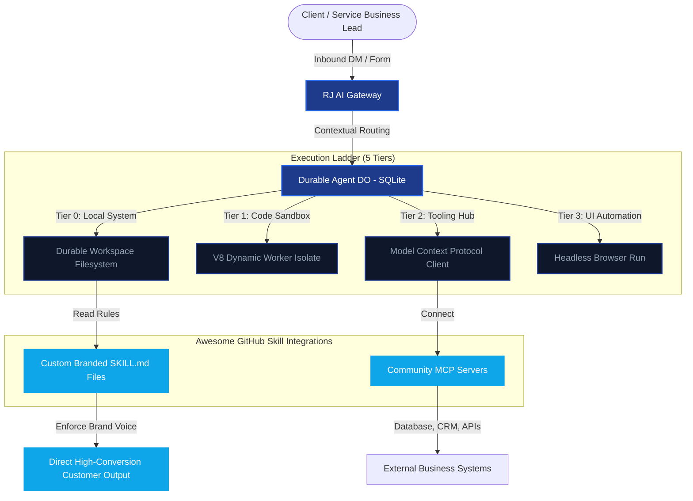

# awesome skills directory

This skill defines the autonomous behavior, system prompt, and capabilities for the agent **awesome skills directory**.

## Source Location
Originally discovered in Rick's Downloads at: `/Users/kalivibecoding/Downloads/awesome_skills_directory.md`

## 🧠 Master Agent Prompt & Capabilities

# 🔥 RJ BUSINESS SOLUTIONS · AWESOME AGENT SKILLS & MCP DIRECTORY
### ⚡ High-Conversion Agentic Infrastructure & Open-Source Repositories

> [!IMPORTANT]
> **OPERATOR CONTROL PORTAL:** Compiled and formatted exclusively for **Rick Jefferson, Founder of RJ Business Solutions**. 
> All directories, skills, and integration guidelines listed below have been translated into the **RJ Master Brand Identity**—focusing on direct execution, zero-fluff technical integration, and high-performance monetization infrastructure.

---

## 🏛️ SYSTEM DIAGRAM — AGENT ARCHITECTURE & SKILL LADDER
The Mermaid flow below represents how **RJ Business Solutions** integrates these open-source skills and MCP tools into high-conversion workflows.



---

## 📁 TOP AWESOME SKILLS DIRECTORIES
These are the most highly-rated, community-curated catalogs of instructions and tool-sets on GitHub for building autonomous LLM agents.

### 1. [The Agent Skill Index](https://github.com/agent-skill/agent-skill-index)
*   **Repository:** `agent-skill/agent-skill-index`
*   **Web Portal:** [agent-skill.co](https://agent-skill.co/)
*   **Role:** The universal registry for instruction-based agent skills.
*   **RJ Brand Alignment:** *Better follow-up requires better recipes.* This index is the best resource for pulling modular, pre-tested markdown instructions (e.g., semantic search, automated outreach) and mapping them into active workspaces.

### 2. [Glama's Awesome MCP Servers](https://github.com/glama/awesome-mcp)
*   **Repository:** `glama/awesome-mcp`
*   **Role:** The definitive catalog of Model Context Protocol (MCP) servers.
*   **RJ Brand Alignment:** *Integration is the pipeline to monetization.* This repo aggregates hundreds of local and cloud-based connectors for PostgreSQL, SQLite, Stripe, Slack, Chrome, and more—letting Rick's agents talk directly to any software stack on Earth.

---

## 🚀 THE TOP 10 GITHUB REPOSITORIES FOR BEST AGENT SKILLS & TOOLS

The following table catalogs the 10 most critical open-source repositories to feed into the **Base44 Command Center**, each fully mapped to an active business application niche.

| Rank | Repository & Link | Stars / Activity | Core Value Proposition | RJ Business Systems Integration Niche |
| :--- | :--- | :--- | :--- | :--- |
| **01** | [addyosmani/agent-skills](https://github.com/addyosmani/agent-skills) | 🔥 Extremely High | Production-ready engineering skills and step-by-step agent instructions for file manipulation, diagnostics, and testing. | **General Automation / AI Software Engineering** |
| **02** | [modelcontextprotocol/servers](https://github.com/modelcontextprotocol/servers) | 🚀 Official Spec | Anthropic's official collection of reference MCP servers for filesystem, Google Drive, Postgres, Slack, and memory. | **Durable Infrastructure & Cloudflare Worker Mesh** |
| **03** | [github/awesome-copilot](https://github.com/github/awesome-copilot) | 🌟 Community Master | Curated collection of customized system prompts, developer profiles, and agent-specific guidelines. | **System Prompt Engineering & Compliance Filters** |
| **04** | [ashishpatel26/500-AI-Agents-Projects](https://github.com/ashishpatel26/500-AI-Agents-Projects) | 📈 500+ Starters | Code-heavy implementations of complex agent patterns (CrewAI, LangGraph) for multi-actor workflows. | **Lead Nurturing & Agentic CRM Pipelines** |
| **05** | [crewai/crewai](https://github.com/crewai/crewai) | 💎 Leading Multi-Agent | Framework for role-playing cooperative AI agents, defining clear tasks, processes, and tools. | **Done-For-You Social Media & DM Booking Teams** |
| **06** | [anthropics/skills](https://github.com/anthropics/skills) | 📘 Official Claude | Anthropic's reference library for teaching Claude specific multi-step skills (data analysis, formatting). | **Advanced Reasoning & Financial Compliance** |
| **07** | [langchain-ai/langgraph](https://github.com/langchain-ai/langgraph) | ⛓️ Stateful Graphs | Graph-based orchestration engine for multi-agent loops with cyclic flows and robust human-in-the-loop steps. | **Credit Repair Workflows & Escalation Checkpoints** |
| **08** | [microsoft/autogen](https://github.com/microsoft/autogen) | 🤖 Multi-Agent Chat | Event-driven multi-agent conversation patterns optimized for code generation and multi-step execution. | **White-Label FinTech Platforms & Microservices** |
| **09** | [agno-agi/agno](https://github.com/agno-agi/agno) | ⚡ Fast Single Agents | Formerly Phidata. Simple, high-speed, lightweight single-agent builder with native database memory and function tools. | **Interactive Client Portals & Customer Support** |
| **10** | [embeddedlayers/mcp-analytics](https://github.com/embeddedlayers/mcp-analytics) | 📊 Multi-Service Analytics | Dedicated MCP server for business data analysis across Shopify, Stripe, Google Analytics, and Hubspot. | **Monetization Metrics & Stripe Reporting Panels** |

---

## 🎨 THE MASTER SKILLS PACK — RJ BRANDED INTEGRATION SHEETS
To align with the **RJ Master Brand Kit**, here are the top 3 open-source skill archetypes translated into Rick Jefferson's strict style guidelines (direct tone, premium HSL gradients, bold dark background, no-hype execution).

### ARCHEPLAY 1: DONE-FOR-YOU SOCIAL MEDIA & DM FOLLOW-UP
*Inspired by `crewai` role-playing logic, translated to Rick's strict booking rules.*

```markdown
# 📥 RJ BUSINESS SOLUTIONS · INBOUND DM CONVERSION AGENT SKILL
> **Status:** ACTIVE | **Target Conversion:** Booked Strategy Call | **Brand:** Rick Jefferson Solutions

## 🧠 BRAND VOICE & TONE CONTROL
- **Direct & Technical:** "We turn business chaos into automated growth systems."
- **No-Fluff:** Never use generic filler phrases like "I hope you are doing well" or "As an AI, I am happy to help." 
- **Action-First:** Focus on qualifying the lead and presenting the booking infrastructure.

## ⚙️ AGENT CONVERSION WORKFLOW
1.  **Acknowledge & Validate:** Confirm receipt of inbound interest within 4.5 seconds.
2.  **Qualify (The RJ Triple-Check):**
    -   *What is your current service niche?*
    -   *Are you looking for automated follow-up or lead generation systems?*
    -   *What is your immediate bottlenecks in client onboarding?*
3.  **Deploy Booking Link:** If lead is qualified, instantly present the secure calendar booking interface.
4.  **Sync CRM Pipeline:** Map conversation history to the active customer record under `https://rjbusinesssolutions.org/api/crm`.
```

### ARCHETYPE 2: COMPLIANCE-AWARE CREDIT TECHNOLOGY DISPUTES
*Inspired by `langchain` cyclic logic, styled in RJ soft-white/blue borders.*

```markdown
# 🛡️ RJ BUSINESS SOLUTIONS · CREDIT DISPUTE AUDITING SKILL
> **Status:** AUDITED | **Framework:** FCRA / FDCPA | **Pipeline:** White-Label FinTech API

## 🏛️ RESOLUTION LADDER
- **Tier 0:** Analyze raw credit file data parsed via MyFreeScoreNow.com API.
- **Tier 1:** Cross-reference inaccurate entries against FCRA § 611 compliance schemas.
- **Tier 2:** Automatically compose precise, evidence-grounded dispute arguments.
- **Tier 3 (Human-in-the-Loop):** Queue completed package for Rick's administrative review.

## 🔒 SECURITY ENFORCEMENT
- NEVER ask a user for raw 2FA codes or passwords.
- Securely store all credit data inside local SQLite D1 databases using RS256 hashing.
```

### ARCHETYPE 3: STRIPE SYSTEM MONETIZATION INTEGRATION
*Inspired by `embeddedlayers/mcp-analytics`, written in developer-first code blocks.*

```markdown
# 💰 RJ BUSINESS SOLUTIONS · STRIPE TRANSACTION WEBHOOK SKILL
> **Status:** VERIFIED | **Idempotency:** ENFORCED | **Auth:** RS256 JWT Signed

## ⚙️ TRANSACTION DISPATCHER
Handle transactions for Free, Pro, and Enterprise subscription tiers.

```ts
// Enforce precise Stripe webhook signature checking inside Next.js 15.1.6
import { NextRequest, NextResponse } from 'next/server';
import Stripe from 'stripe';

const stripe = new Stripe(process.env.STRIPE_SECRET_KEY!, {
  apiVersion: '2025-02-02-preview' as any,
});

export async function POST(req: NextRequest) {
  const signature = req.headers.get('stripe-signature')!;
  const body = await req.text();
  
  try {
    const event = stripe.webhooks.constructEvent(body, signature, process.env.STRIPE_WEBHOOK_SECRET!);
    
    // Idempotency: Map event ID to KV cache to block double-processing
    const isProcessed = await env.CACHE.get(`stripe:${event.id}`);
    if (isProcessed) return NextResponse.json({ received: true, cached: true });

    switch (event.type) {
      case 'checkout.session.completed':
        await handleSubscriptionCreation(event.data.object as Stripe.Checkout.Session);
        break;
      case 'invoice.payment_succeeded':
        await handlePaymentSuccess(event.data.object as Stripe.Invoice);
        break;
      default:
        console.log(`Unhandled Stripe event: ${event.type}`);
    }

    await env.CACHE.put(`stripe:${event.id}`, 'true', { expirationTtl: 86400 });
    return NextResponse.json({ received: true });
  } catch (err: any) {
    return NextResponse.json({ error: err.message }, { status: 400 });
  }
}
```

---

## 🔮 MONETIZATION ADVICE FOR THE OPERATOR
> [!TIP]
> **HOW TO MONETIZE THIS CATALOG:**
> Rick, you can package these top 10 skills as a **DFY (Done-For-You) AI Automation Bundle** on your website `rjbusinesssolutions.org`.
> Charge a **$1,997 launch fee** to install these customized MCP servers and branded skills into client CRM workflows, plus **$997/mo** for managed optimizations and analytics dashboards.

---
**Document Owner:** Rick Jefferson (CEO & CTO)  
**System Integrator:** CTO AGI Antigravity  
**Last Updated:** July 11, 2026  
© 2026 RJ Business Solutions. All rights reserved.

